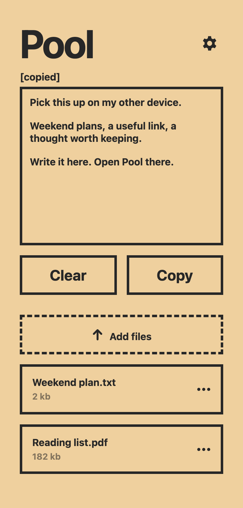
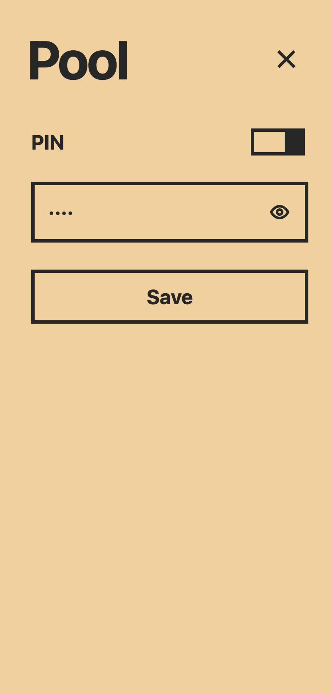

<div align="center">


# Pool

**A shared note and file drop for your own devices.**

Write it here. Pick it up there.

[](https://github.com/tier777/pool-back/releases/latest)
[](go.mod)
[](#how-it-works)

[Get started](#get-started) · [Download](https://github.com/tier777/pool-back/releases/latest) · [Configuration](#configuration)

</div>

<p align="center">
  
  &nbsp;
  
</p>
<p align="center"><sub>Actual interface, illustrated with demo content.</sub></p>

## One place for the next handoff

Pool keeps one shared note and a collection of files available from your browser. Open it on your laptop, phone or another device that can reach your server.

- **Write and move on.** The note autosaves; other open devices check for updates every two seconds.
- **Copy in one click.** Clear the note when you are done. Small inline messages confirm actions and explain failures.
- **Drop your files.** Upload, download and delete files from the same screen.
- **Set your PIN.** Enable or disable protection, reveal the active PIN, or edit it and save.
- **Keep it yours.** One self-hosted Go service, SQLite and a local file directory. No account service or external browser dependencies.

## Get started

### Docker Compose

You need Docker with Compose v2 and OpenSSL.

```sh
git clone https://github.com/tier777/pool-back.git
cd pool-back

umask 077
mkdir -p secrets
openssl rand -base64 24 > secrets/app_password

docker compose up -d --build
```

Open **[localhost:8080](http://localhost:8080)**. Your initial PIN is the generated value in `secrets/app_password`; open that file to read it. You can change it in Settings after signing in.

The container port is published on loopback only. To use another host port:

```sh
POOL_PORT=9090 docker compose up -d --build
```

For access from other devices, put an HTTPS reverse proxy in front of Pool. See [remote access](#remote-access).

### Download a binary

The [latest release](https://github.com/tier777/pool-back/releases/latest) includes archives for Linux and macOS, on x86-64 and ARM64. Each archive contains the executable and its `web/` assets.

Extract the matching archive and run these commands **from the extracted directory**:

```sh
umask 077
mkdir -p secrets
openssl rand -base64 24 > secrets/app_password
APP_PASSWORD_FILE="$PWD/secrets/app_password" ./pool
```

Keep `web/` alongside the executable and start Pool from that directory. Open [localhost:8080](http://localhost:8080) and use the generated PIN.

The release page also provides `SHA256SUMS` for checksum verification. macOS binaries are unsigned and not notarized.

### Run from source

With **Go 1.26.6 or newer**, clone the repository, create the PIN file as above, then run from the repository root:

```sh
APP_PASSWORD_FILE="$PWD/secrets/app_password" go run .
```

## Using Pool

| Action | What happens |
| --- | --- |
| Edit the note | Autosaves after a short pause. Other devices refresh in the background. |
| **Copy** | Copies the note and briefly shows `[copied]`. |
| **Clear** | Empties and saves the note. |
| **Add files** or drag and drop | Uploads files into local storage. |
| Click a filename | Downloads the file. Use its menu to delete it. |
| Open the gear | Shows PIN settings. The eye reveals the active PIN. |
| **Save** in Settings | Applies PIN changes and briefly shows `[saved]`. |
| Close settings | Returns to the note and discards unsaved edits. |

Each installation serves **one Pool**. There are no separate users or workspaces. Protection is optional; with it disabled, anyone who can reach the server can read and change the note, files and settings.

## How it works

```text
Your browsers  →  Pool (Go)  →  SQLite: note, file metadata, PIN hash
                            →  Local directory: uploaded files
```

The client is plain HTML, CSS and JavaScript, served by the same process as the API. No frontend build step or CDN is required.

A native installation uses `data.db` and `data.db.files/` by default. Compose keeps `/data/pool.db` and `/data/pool.db.files/` in the named `pool-data` volume. Back them up together.

### PIN and sessions

- PINs accept **3 or more characters**, including letters, up to 1024 bytes. Use a longer secret for an internet-facing installation.
- SQLite stores a salted **PBKDF2-SHA256 hash** with 600,000 iterations. The configured startup PIN initializes a new database; later PIN changes live in SQLite and survive restarts.
- The startup PIN configuration is still required on every launch. Changing it does **not** reset an existing database's PIN.
- Sessions last eight hours. The session cookie is `HttpOnly` and `SameSite=Strict`, with `Secure` enabled outside loopback HTTP development. Write requests require a CSRF token; repeated failed PIN attempts are rate-limited.
- To support the eye control, the active PIN is retained in the authenticated session's server memory and returned through a non-cacheable settings response. It is not written to the database or browser storage in plaintext. Treat a live authenticated session as access to the PIN itself.
- PIN changes revoke other sessions. Session expiry or a server restart requires signing in again when protection is enabled.

### Remote access

Keep Pool's HTTP listener on loopback and publish it through an HTTPS reverse proxy such as Caddy or nginx. Forward the original protocol with `X-Forwarded-Proto: https`; enable HSTS at the proxy after HTTPS is working.

Configure upload limits and timeouts at your proxy. File uploads stream to disk; available storage and proxy policy set the practical limits. Note requests are limited to 1 MiB, including their JSON envelope.

Compose runs the application as a non-root user with a read-only root filesystem, dropped Linux capabilities and a persistent data volume. A short-lived initialization service prepares that volume's permissions.

## Configuration

| Variable | Native default | Purpose |
| --- | --- | --- |
| `APP_PASSWORD_FILE` | — | PIN file; takes precedence over `APP_PASSWORD`. Compose mounts `/run/secrets/app_password`. |
| `APP_PASSWORD` | — | Initial PIN when no file is configured. At least 3 characters, at most 1024 bytes. |
| `BIND_ADDRESS` | `127.0.0.1` | Listen address. Compose uses `0.0.0.0` inside the container. |
| `PORT` | `8080` | Application port. |
| `DATA_PATH` | `./data.db` | SQLite path; uploaded files use the same path with `.files` appended. |
| `POOL_PORT` | `8080` | Compose-only host port, published on `127.0.0.1`. |

The parent directory of `DATA_PATH` must exist and be writable. Compose sets `DATA_PATH=/data/pool.db`.

## Operations

### Health check

```sh
curl --fail http://localhost:8080/api/ping
# pong

docker compose ps
```

### Back up

Stop writes, then copy the database and file directory together:

```sh
mkdir -p backups
docker compose stop pool
docker compose cp pool:/data/. ./backups/data
docker compose start pool
```

For a native installation, stop the process and copy both the database and its adjacent `.files/` directory. The server handles `SIGTERM` with a ten-second graceful shutdown.

<details>
<summary>Restore a Compose backup</summary>

The following restores `backups/data/` into the `pool-data` volume. Keep a copy of the current data before restoring an older backup.

```sh
docker compose down
docker run --rm \
  --volume pool-data:/data \
  --volume "$PWD/backups:/backup:ro" \
  alpine:3.24 sh -c 'cp -a /backup/data/. /data/ && chown -R 10001:10001 /data && chmod -R u=rwX,go= /data'
docker compose up -d
```

</details>

### Upgrade

Take a backup first, then update the source installation:

```sh
git pull --ff-only
docker compose up -d --build
```

For a binary installation, replace the executable **and** `web/` with the new archive's versions, keeping your database, uploads and PIN configuration.

## Development

```sh
go test -race ./...
node --check web/app.js
go build -trimpath -o pool .
```

Node.js is only needed for the optional JavaScript syntax check. The application itself requires no Node.js runtime.

Found a problem or have a small improvement in mind? [Open an issue](https://github.com/tier777/pool-back/issues).
